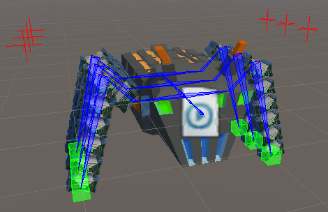
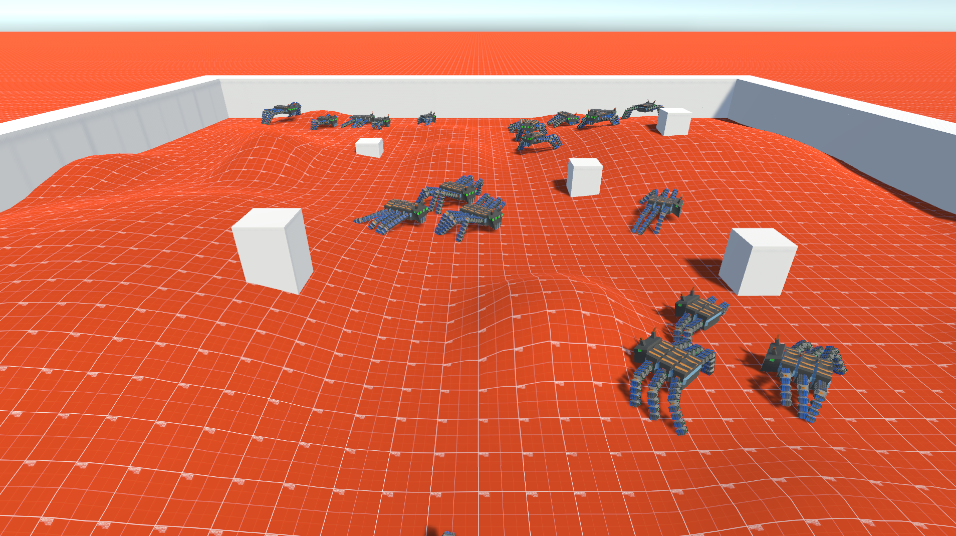

# Procedural Animation and Flock Behavior

This is part 2 of the a project made by [akua21](https://github.com/akua21) and [Pheithar](https://github.com/Pheithar) for the course 02563 Generative Methods for Computer Graphics at DTU in Spring of 2023. The project consisted in creating a procedurally generated 3D model of a 'Robotic' ant and later animate in Unity. In Unity, additionally, we implemented a flock behavior for the ants. We dedicated mst of the time in automatizing the procedural animation setup for our specific character, so i could work independently of the number of legs, segments and size of the legs of the ant. Due to this procedural animation, the character can interact and traverse complex terrains as shown in the flock behavior.

The interesting setup allows to many different bots of different sizes and aspects to behave as a flock.

## Unity setup images

_Animation setup of the AntBot in Unity_

_Flock of AntBots traversing a complex terrain with obstacles_

## Extended Abstract

As part of the course, we where asked to write an extended abstract of the project. You can find it in [Procedural Pipeline: Procedural animation and flock behaviour using Unity](./readme_files/Procedural_Animation.pdf).

_Note: Although the author of the abstract is indicated solely as Alba Reinders Sánchez ([akua21](https://github.com/akua21)) the work was done by both authors._
